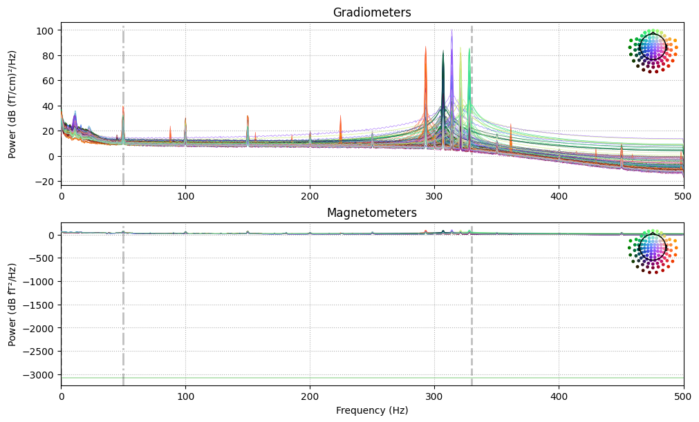

# Flat sensors

Flat sensors can dampen graphs by exhibiting abnormal amplitudes when autoscaling is applied to the signal power spectrum. To ensure accurate visualization, MEGAP first detects and excludes these flat sensors. By detecting them rather than merely adjusting the y-axis, MEGAP can display a warning message ("flat sensor excluded") on the plots. It should be noted that the comprehensive detection of all bad sensors is deferred to later steps.

```python
data.compute_psd().plot()
```

<figure><figcaption><p>Damped power spectrum with one flat sensor</p></figcaption></figure>


The MNE library's function for [plotting PSD](https://mne.tools/stable/generated/mne.time_frequency.Spectrum.html#mne.time_frequency.Spectrum.plot) does not include built-in parameters to disable autoscaling or manually rescale the y-axis.


<figure><figcaption><p>MEGAP output power spectrum with warning massage</p></figcaption></figure>

To identify flat sensors based on [PREP](https://www.frontiersin.org/journals/neuroinformatics/articles/10.3389/fninf.2015.00016/full), the code first detects channels containing NaN values, which indicate missing or corrupted data. It then flags channels with flat signals by evaluating two criteria: Median Absolute Deviation (MAD) and Standard Deviation (STD). Channels with MAD or STD values below a predefined threshold ([`flat_threshold = 1e-18`](https://mne.tools/stable/generated/mne.preprocessing.find_bad_channels_maxwell.html#mne.preprocessing.find_bad_channels_maxwell) `T or T/m`) are considered flat, as they exhibit no meaningful signal variation.&#x20;

```python
meg_picks_diff =  mne.pick_types(raw_meg.info, meg=True, ref_meg=False)
meg_data = raw_meg.get_data(picks=meg_picks_diff)
ch_names = [raw_meg.ch_names[i] for i in meg_picks_diff]
# Detect channels containing any NaN values
nan_channel_mask = np.isnan(np.sum(meg_data, axis=1))
nan_channels = np.array(ch_names)[nan_channel_mask]
flat_threshold=1e-18
# Detect channels with flat signals
flat_by_mad = median_abs_deviation(meg_data, axis=1) < flat_threshold
flat_by_std = np.std(meg_data, axis=1) < flat_threshold
flat_channel_mask = flat_by_mad | flat_by_std
flat_channels = np.array(ch_names)[flat_channel_mask]

flat_channel_indices=[]
flat_channel_indices.extend(meg_ch_idx[flat_channel_mask])
flat_channel_indices.extend(meg_ch_idx[nan_channel_mask])

```
