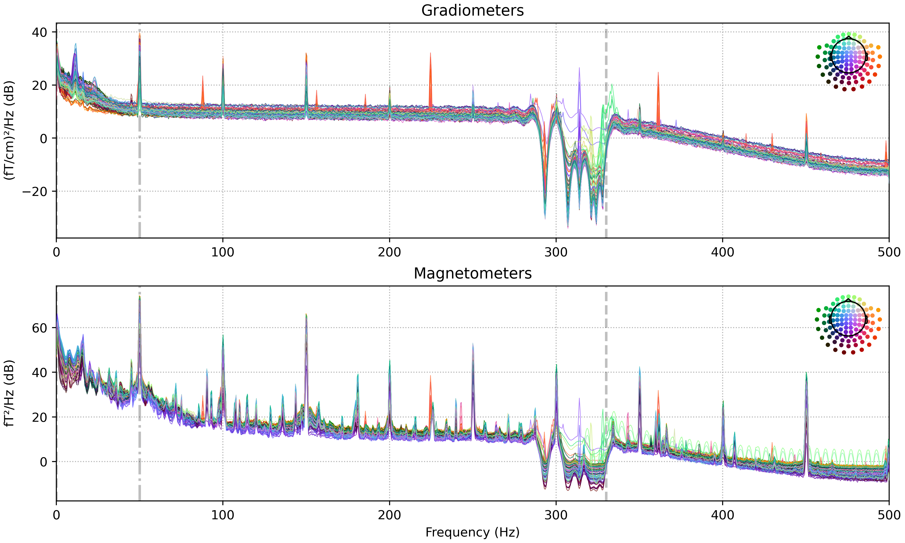

# Filter cHPI

After determining the head position using cHPI coils, the next step is to remove any noise generated by these coils. This is accomplished with the [`filter_chpi`](https://mne.tools/stable/generated/mne.chpi.filter_chpi.html) command from the MNE library. Users can adjust the parameters related to this step in the `config_pipeline.cfg` file, allowing for customization based on the specific needs of their dataset. If the data does not contain cHPI coil information, this procedure will be skipped automatically.

```json
"filter_chpi": {
	"include_line": false,
	"t_step": 0.001,
	"t_window": 0.2,
	"ext_order": 1,
	"allow_line_only": false
},
```

<figure><figcaption><p>After filtering cHPI coil noises</p></figcaption></figure>


By default, `filter_chpi` command also includes a notch filter for removing line noises. However, we disable this feature and postpone line noise removal to the next step in MEGAP.


In CTF devices, the contribution from each cHPI coil is extracted through [spectral line extraction](https://www.sciencedirect.com/science/article/pii/S1053811912011597?via%3Dihub), which eliminates the need for running the `filter_chpi` command. This is because the CTF system does not exhibit any distinct peaks in PSDs for cHPI signals, as it uses a different method to monitor and track head positions. Therefore, the procedure for filtering noise from cHPI coils is not required for CTF data.

